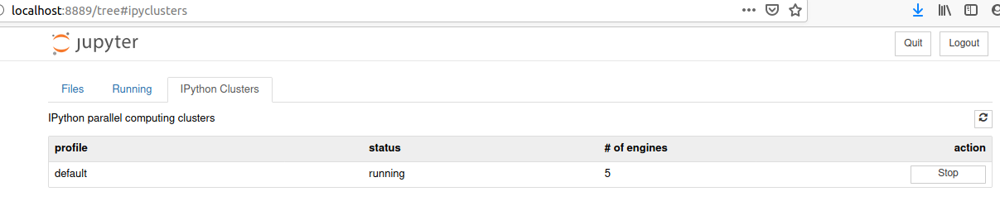

# A hitchhiker's guide to sequential sampling models

## What is sequential sampling? 
Sequential sampling is ....

This docker image included XX major toolbox for sequential sampling modeling, including:
* HDDM is a python package for hierarchical drift diffusion modelling, see [here](http://ski.clps.brown.edu/hddm_docs/index.html) for more.
* pyddm
* ...

## Why we write this guide
1. Sequential sampling models is an influential model, used widely in different fields
2. Sequential sampling models has become a complex cluster of models, 
3. The packages can be used for different models are not straightforward.

## How to use this guide

First, this guide included theoretical and pratical parts. 
Second, to use the partical parts, you need to pull the docker image from docker hub. To do so, first install docker and test it. There are many tutorial on this, here is one on [docker's website](https://docs.docker.com/engine/install/ubuntu/) for linux. Then, pull the docker image from docker hub:

```
docker pull hcp4715/ddm:tutorial_v1
```

**Note**: you may need sudo permission to run `docker`.

After pulling it from docker hub, you can then run jupyter notebook in the container (e.g., in bash of linux):

```
docker run -it --rm --cpus=5 \
-v /home/hcp4715/Data_Analysis/HDDM:/home/jovyan/hddm \
-p 8888:8888 hcp4715/ddm:tutorial_v1 jupyter notebook
```

`docker run` ---- run a docker image in a container

`-it` ---- Keep STDIN open even if not attached

`--rm` ---- Automatically remove the container when it exits

`--cpus=5` ---- Number of cores will be used by docker

`-v` ---- mount a folder to the container

`/home/hcp4715/Data_Analysis/HDDM` ---- the directory of a local folder where I stored my data. 

`-p` ---- Publish a container’s port(s) to the host

`hcp4715/ddm:tutorial_v1` ---- the docker image to run

`jupyter notebook` ---- Open juypter notebook when start running the container.

After running the code above, bash will has output like this:

```
....
To access the notebook, open this file in a browser:
        file:///home/jovyan/.local/share/jupyter/runtime/nbserver-6-open.html
Or copy and paste one of these URLs:
    http://174196acc395:8888/?token=75f1a7a8ffcbb55f0c2802433a9a5d57ac00868e05089c09
 or http://127.0.0.1:8888/?token=75f1a7a8ffcbb55f0c2802433a9a5d57ac00868e05089c09
```

Copy the url (http://127.0.0.1:8888/?.......) to a browser (firefox or chrome) and it will show a web page, this is the interface of jupyter notebook! 

Under the `Files` tab, there should be three folders: `work`, `tutorial`, and `hddm`. The `hddm` folder is the local folder mounted in docker container. The `tutorial` folder was the one built in docker image, this folder includes one dataset and one jupyter notebook, you can test the parallel processing by running this jupyter notebook.

Enter `hddm` folder, you can start your analysis within jupyter notebook.

Note that before diving into the jupyter notebook and start analysis, don't forget start multiple engines under the `IPython Clusters` tab in the jupyter notebook window.



The number of engines started should be less than or equals to the number of cores of your machine. Later, when run parallel processing, the number of the engines should be less or equals to the number of engines you started here. If mulitiple engines haven't been started before running the parallel processing, the following error will occur:

```
OSError: Connection file '~/.ipython/profile_default/security/ipcontroller-client.json' not found.

You have attempted to connect to an IPython Cluster but no Controller could be found.

Please double-check your configuration and ensure that a cluster is running.
```

## Using the tutorial scipts
You can also run the tutorial scripts without mounting local folder to the docker container. The example data set is from [my previous study](https://collabra.org/articles/10.1525/collabra.301/). The example jupyter notebook is used to test the `ipyparallel` package. Run the following code to use the example.

```
docker run -it --rm --cpus=5 \
-p 8888:8888 hcp4715/ddm:tutorial_v1 jupyter notebook
```

## Potential errors
* Permission denied. Please see this [post](https://groups.google.com/forum/#!topic/hddm-users/Qh-aOC0N6cU) about the permission problem.

## How this docker image was built
An alternative way to get the docker image is to build it from `Dockerfile`.

I built this docker image under Ubuntu 20.04. 

This Dockerfile is modified by Dr. Rui Yuan @ Stanford, based on the Dockerfile of [jupyter/scipy-notebook](https://hub.docker.com/r/jupyter/scipy-notebook/dockerfile). We installed additional packages for HDDM and `ipyparallel`, and configured the `ipyparallel` so that we can run it in jupyter noebook (doesn't work for jupyterlab yet). See `Dockerfile` for the details

Code for building the docker image (don't forget the `.` in the end):

```
docker build -t hcp4715/ddm:tutorial_v1 -f Dockerfile .
```
You can replace `hcp4715` with your username in docker hub, and replace `ddm:tutorial_v1` with a name and tag you prefer.

## Acknowledgement
Thank [@madslupe](https://github.com/madslupe) for his previous HDDM image, which laid the base for the current version. Thank [Dr Rui Yuan](https://scholar.google.com/citations?user=h8_wSLkAAAAJ&hl=en) for his help in creating the Dockerfile.
